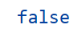

# EWT_labs

## Лабораторные работы по предмету "Эргономические веб-технологии БГУИР
### Хоружик Елизавета, гр. 210902

[Лабораторные работы](https://lizahoruzhik.github.io/EWT_labs/)

***
# CV

## Horuzhik Elizaveta

## Contact Information
* Phone: +375336856687
* E-mail: liza.horuzhik@gmail.com
* GitHub: [LizaHoruzhik](https://github.com/LizaHoruzhik)
* Discord: @liza.horuzhik
* Telegram: @tinynisme

## About me
I'm a third year student of Belarusian State University of Informatics and Radioelectronics.

## Skills
* HTML, CSS
* JavaScript
* Git, GitHub
* Java, Java Spring
* VS Code

## Code Examples
__KATA__ from CodeWares: _There was a test in your class and you passed it. Congratulations! But you're an ambitious person. You want to know if you're better than the average student in your class. You receive an array with your peers' test scores. Now calculate the average and compare your score! Return true if you're better, else false! Note: Your points are not included in the array of your class's points. Do not forget them when calculating the average score!_
```javascript
function betterThanAverage(classPoints, yourScore) {
    let totalPoints = 0;
    for (let i = 0; i < classPoints.length; i++) {
        totalPoints += classPoints[i];
    }
    totalPoints += yourScore;
    const average = totalPoints / classPoints.length;
    return yourScore >= average;
}

const classPoints = [75, 85, 95, 70, 80];
const yourScore = 90;

console.log(betterThanAverage(classPoints, yourScore));
```
The result:


## Experience
I did some assignments at the university. 
Subject    | Link 
-----------|:-------: 
Ergonomic web-technologies       |   [EWT_labs](https://github.com/LizaHoruzhik/EWT_labs) 
User interfaces of information systems    |   [PIIS_labs](https://lizahoruzhik.github.io/PIIS_laby/) 


## Education
Belarusian State University of Informatics and Radioelectronics, the Faculty of Computer-Aided Design, Engineering and Psychological Support of Information Technologies, 2022 - nowadays.

## Languages
* English - B1